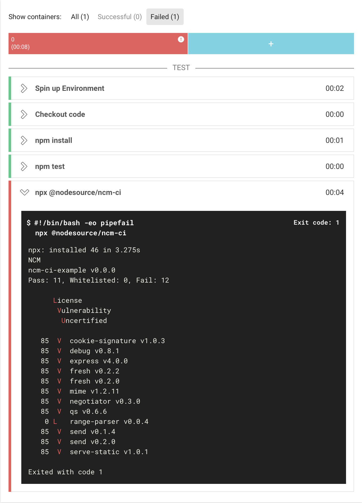
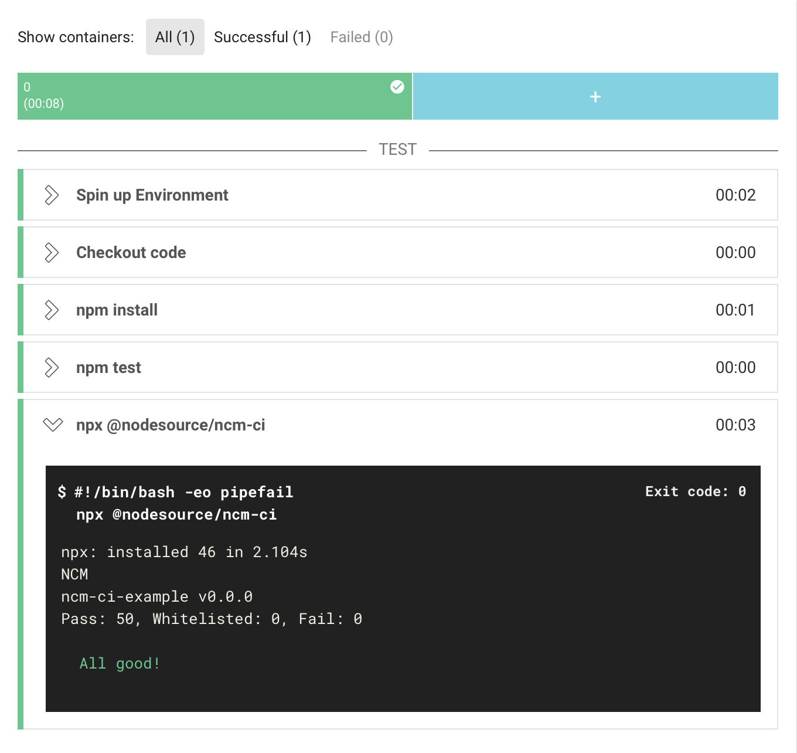

# ncm-ci-example

This project is set up with [NCM CI](https://github.com/nodesource/ncm-ci) on various CICD systems to demonstrate how it will
pass or fail your builds depending on the state of your node_modules dependency tree.

- [Read the docs](https://docs.nodesource.com/ncm_v2)
- [Learn more about NodeSource Certified Modules](https://nodesource.com/products/certified-modules)
- [__Sign up for an account to get started!__](https://accounts.nodesource.com/)

## CICD

The following CICD systems have been set up:

| System | OS | Config | Passing build | Failing build |
|--------|----|--------|---------------|---------------|
| [Travis](https://travis-ci.org) | Linux | [.travis.yml](.travis.yml) | [Build #8](https://travis-ci.org/nodesource/ncm-ci-example/builds/439531282)         | [Build #11](https://travis-ci.org/nodesource/ncm-ci-example/builds/439531923) |
| [AppVeyor](https://www.appveyor.com) | Windows | [appveyor.yml](appveyor.yml) | [1.0.7](https://ci.appveyor.com/project/juliangruber/ncm-ci-example/builds/19395094) | [1.0.10](https://ci.appveyor.com/project/juliangruber/ncm-ci-example/builds/19395134) |
| [CircleCI](https://circleci.com) | Linux | [.circleci/config.yml](.circleci/config.yml) | [#4](https://circleci.com/gh/nodesource/ncm-ci-example/4)                            | [#6](https://circleci.com/gh/nodesource/ncm-ci-example/6) |

Remember that you will need to set `NCM_TOKEN=xxx` as an environment variable, which should not be made visible to the public. For instruction on obtaining a token, [read the docs](https://docs.nodesource.com/ncm_v2).

## Output

In case there are problematic dependencies in your tree, ncm-ci will list them out:

Fix those dependencies and you'll see _All good_!

## Pull requests

This project's #master branch passes ncm-ci, however an example [Pull request #1](https://github.com/nodesource/ncm-ci-example/pull/1) has been set up to demonstrate how ncm-ci will fail your build when vulnerable or noncompliant dependencies are introduced.

